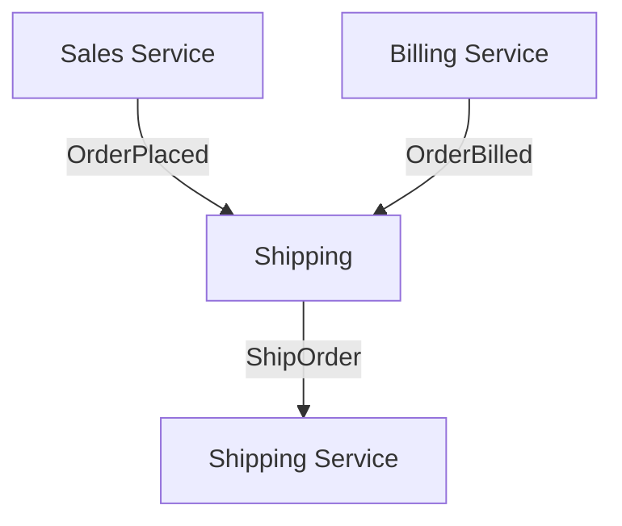

# NService Bus

## Sagas
### Definition of Saga
The term saga was coined by **Hector Garcia-Molina**. His paper describes a scheme for breaking up long-lived business transactions in order to shorten the time period during which databases need to hold locks—these locks are needed to ensure atomicity and consistency of the transaction, the downside of which is that other transactions touching the same data cannot proceed concurrently.

The **Saga pattern** describes how to solve distributed (business) transactions without two-phase-commit as this does not scale in distributed systems. The basic idea is to break the overall transaction into multiple steps or activities. Only the steps internally can be performed in atomic transactions but the overall consistency is taken care of by the Saga. The Saga has the responsibility to either get the overall business transaction completed or to leave the system in a known termination state. So in case of errors a business rollback procedure is applied which occurs by calling compensation steps or activities in reverse order.

The pattern gains more traction recently as systems get more and more complex, distributed and remote —so the “good old” ACID transactions have finally reached their limit. Say hello to eventual consistency.

When you build a system with asynchronous messages, you divide each process into discrete message handlers that are executed when an incoming message arrives. Your system naturally becomes more reliable because each of these message handlers can be retried until they are successful. Additionally, it becomes easier to understand since each message handler handles just one specific task.

**What Is Saga?** Saga is a message-driven state machine, or a collection of message handlers that persist shared state. Sagas represent a business process where multiple related messages can trigger state changes.

A saga is a sequence of local transactions. Each local transaction updates the database and publishes a message or event to trigger the next local transaction in the saga. If a local transaction fails because it violates a business rule then the saga executes a series of **compensating transactions** that undo the changes that were made by the preceding local transactions.

It’s important to note that a **compensating transaction** does not necessarily return the database to the original state it was in before the transaction was run. The compensation only needs to be semantically equivalent.


**What problem solves Saga?** You can solve with sagas problems such as **integrating with external services** or **replacing nightly batch jobs** with a system that processes changes in real time.

In **Domain Driven Design** (DDD) the pattern is well known as you need to apply it as soon as you have use cases involving multiple bounded contexts to collaborate. In the **microservice** community it is less known but necessary whenever an overall flow involves multiple services.

**Sample problem**. Let's say a Shipping service can't ship an order (that is, send a ShipOrder command) until it has successfully received OrderPlaced from the Sales service and OrderBilled from the Billing service. Normal message handlers don't store any state, so we need a way to keep track of which events have already been received.



We will create a saga in the Shipping endpoint that will handle the OrderPlaced and OrderBilled events. When it receives both, it'll send the ShipOrder command to initiate the delivery. 

It's useful to think of sagas as **policies**. After all, the main use of a saga is to decide what to do once additional incoming messages arrive. Therefore it's useful to use the word Policy in a saga's name, as an example **ShippingPolicy**.

There are two ways of coordination sagas:

**Choreography** (Events) - each local transaction publishes domain events that trigger local transactions in other services. When there is no central coordination, each service produces and listens to the other service's events and decides if an action should be taken or not.

**Orchestration** (Command) - an orchestrator (object) tells the participants what local transactions to execute. When a coordinator service is responsible for centralizing the saga's decision making and sequencing business logic.


### Saga’s Command/Orchestration sequencing logic
In the orchestration approach, we define a new service with the sole responsibility of telling each participant what to do and when. The saga orchestrator communicates with each service in a command/reply style telling them what operation should be performed.


**Orchestration-based sagas have a variety of benefits**
- Avoid cyclic dependencies between services, as the saga orchestrator invokes the saga participants but the participants do not invoke the orchestrator
- Centralize the orchestration of the distributed transaction
- Reduce participants complexity as they only need to execute/reply commands.
- Easier to be implemented and tested
- The transaction complexity remains linear when new steps are added
- Rollbacks are easier to manage
- If you have a second transaction willing to change the same target object, you can easily put it on hold on the orchestrator until the first transaction ends.


### Disadvantages of the Saga pattern
The Saga pattern is difficult to debug, especially when many microservices are involved. Also, the event messages could become difficult to maintain if the system gets complex. Another disadvantage of the Saga pattern is it does not have read isolation. For example, the customer could see the order being created, but in the next second, the order is removed due to a compensation transaction.

### Routing Slips
Essentially they’re a stateless alternative to Sagas and very useful for tackling workflow-processing needs


## Endpoint
An endpoint is a logical entity that communicates with other endpoints via messaging. Each endpoint has an identifying name and contains a collection of message handlers and sagas. An endpoint can be deployed to a number of machines and environments. Each deployment of an endpoint is an instance. Each endpoint instance has an input queue which contains messages for the endpoint instance to process.

It is common for each endpoint to have a single endpoint instance. As endpoints need to scale-out, additional endpoint instances can be added. This collection of endpoint instances still represents a single logical endpoint.

### Hosting
This sample shows how to host an NServiceBus endpoint using the NServiceBus.Host.
```csharp
[Deprecated]
[EndpointName("Samples.NServiceBus.Host")]
public class EndpointConfig : IConfigureThisEndpoint
{
    public void Customize(EndpointConfiguration endpointConfiguration)
    {
        endpointConfiguration.EnableInstallers();
        endpointConfiguration.UsePersistence<LearningPersistence>();
        endpointConfiguration.UseTransport<LearningTransport>();
    }
}
```
I order to acomplish with new technologies **is not recommendable to setup the endpoint using NServiceBus.Host**
