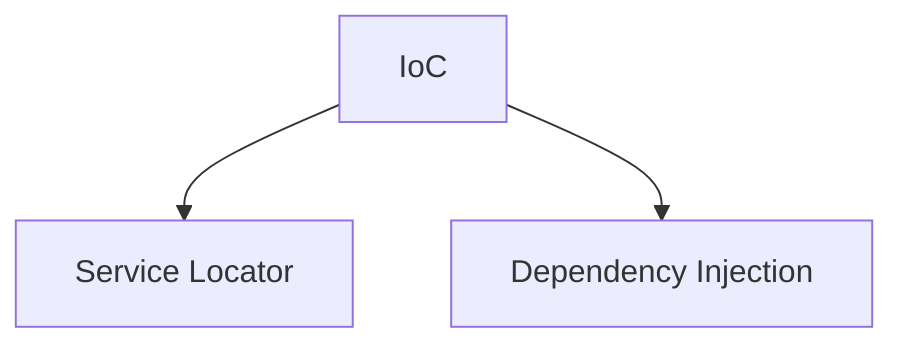

# Software Design Patterns and Practices

### Some of theory
Software components are subject to change depending on the business. Since software is for business and the reverse is not always true. If so, then we have to keep in mind that, when change comes, our application can adapt smoothly or at least by giving only a little trouble.

- **Software design principle**: Principle provides us guideline. Principle says what is right and what is wrong. It doesn’t say us how to solve problem. It just gives some guideline so that we can design good software and avoid bad design. Some principles are DRY, OCP, DIP, etc.
- **Software design pattern**: Pattern is a general reusable solution to a commonly occurring problem within a given context in software design. Some patterns are factory pattern, Decorator pattern etc.

### Service Locator Pattern
The service locator pattern is a design pattern used in software development to encapsulate the processes involved in obtaining a service with a strong abstraction layer. This pattern uses a central registry known as the “service locator” which on request returns the information necessary to perform a certain task.
The ServiceLocator is responsible for returning instances of services when they are requested for by the service consumers or the service clients. 

Service Locator pattern does not describe how to instantiate the services. It describes a way to register services and locate them. The goal of this pattern is to improve the modularity of your application by removing the dependency between the client and the implementation of an interface.

The service locator pattern is still a good option to remove the dependency between the client and the implementation of an interface when you can't use Dependency Injection. Both patterns have the same goal, but use very different approaches to achieve them. The three most **common arguments against the service locator pattern** are:

- All components need to have a reference to the service locator, which is a singleton.
    - If you use your components in different applications and environments, introducing a dependency to your service locator class might be problematic because the class might not exist in all environments.
    - Implementing the service locator as a singleton can also create scalability problems in highly concurrent environments.
- The service locator makes the application hard to test.
- Higher risk to introduce breaking changes.

Instead of using a global mechanism to give some code access to an object it needs, first consider passing the object to it instead. That’s dead simple, and it makes the coupling completely obvious. That will cover most of your needs. But, there are some times when manually passing around an object is gratuitous or actively makes code harder to read. Some systems, like logging or memory management, shouldn’t be part of a module’s public API.

##### The Pattern
A **service** class defines an abstract interface to a set of operations. A concrete **service provider** implements this interface. A separate **service locator** provides access to the service by finding an appropriate provider while hiding both the provider’s concrete type and the process used to locate it. 


##### Basic Sample
The service locator is a singleton. The CoffeeServiceLocator class has a private constructor and keeps a reference to itself. You can get a CoffeeServiceLocator instance by calling the static getInstance method on the CoffeeServiceLocator class.

```csharp
public class CoffeeServiceLocator {
    private static CoffeeServiceLocator locator;

    private CoffeeMachine coffeeMachine;

    private CoffeeServiceLocator() {
        // configure and instantiate a CoffeeMachine
        var beans = new HashMap<CoffeeSelection, CoffeeBean>();
        beans.put(CoffeeSelection.ESPRESSO, new CoffeeBean("My favorite espresso bean", 1000));
        beans.put(CoffeeSelection.FILTER_COFFEE, new CoffeeBean("My favorite filter coffee bean", 1000));
        
        coffeeMachine = new PremiumCoffeeMachine(beans);
    }

    public static CoffeeServiceLocator getInstance() {
        if (locator == null) {
            locator = new CoffeeServiceLocator();
        }
        return locator;
    }

    public CoffeeMachine coffeeMachine() {
        return coffeeMachine;
    }
}

public class CoffeeApp {
    public Coffee prepareCoffee(CoffeeSelection selection)
        var coffeeMachine = CoffeeServiceLocator.getInstance().coffeeMachine();
        var coffee = coffeeMachine.brewFilterCoffee();
        
        return coffee;
    }
}
```

##### Generic Type SL
This is another type of service locator, the difference between strong and Generic type is that it can deal with various types since this is generic in nature.

```csharp
public interface IService  
{  
        T GetService<T>();  
}  

public class ServiceLocator : IService  
{  
    public Dictionary<object, object> servicecontainer = null;  
    public ServiceLocator()  
    {  
        servicecontainer = new Dictionary<object, object>();  
        servicecontainer.Add(typeof(IServiceA), new ServiceA());  
        servicecontainer.Add(typeof(IServiceB), new ServiceB());  
    }  
    public T GetService<T>()  
    {  
        try  
        {  
            return (T)servicecontainer[typeof(T)];  
        }  
        catch (Exception ex)  
        {  
            throw new NotImplementedException("Service not available.");  
        }  
    }  
}   

class Program  
{  
    static void Main(string[] args)  
     {  
        var loc = new ServiceLocator();  
        
        var serviceA =  loc.GetService<IServiceA>();  
        serviceA.Execute();  
  
        var serviceB = loc.GetService<IServiceB>();  
        serviceB.Execute();  
     }  
}   
```

##### Null Service
What if we try to use the service before a provider has been registered, it returns NULL. If the calling code doesn’t check that, we’re going to crash the application. Fortunately, there’s another design pattern called **Null Object** that we can use to address this. The basic idea is that in places where we would return NULL when we fail to find or create an object, we instead return a special object that implements the same interface as the desired object. Its implementation basically does nothing, but it allows code that receives the object to safely continue on as if it had received a real one.

This is also useful for intentionally failing to find services. If we want to disable a system temporarily, we now have an easy way to do so, simply don’t register a provider for the service, and the locator will default to a null provider.

### Dependency Injection Pattern
Dependency injection is a programming technique that makes a class independent of its dependencies. It achieves that by decoupling the usage of an object from its creation. This helps you to follow SOLID’s dependency inversion and single responsibility principles. Their goal is to improve the reusability of your code. 

They also aim to reduce the frequency with which you need to change a class. Dependency injection supports these goals by decoupling the creation of the usage of an object. That enables you to replace dependencies without changing the class that uses them. It also reduces the risk that you have to change a class just because one of its dependencies changed.

##### The 4 roles in dependency injection
If you want to use this technique, you need classes that fulfill four basic roles. These are:
- The **service** you want to use.
- The **client** that uses the service.
- An **interface** that’s used by the client and implemented by the service.
- The **injector** which creates a service instance and injects it into the client.

The injector is the only role that isn’t required by the dependency inversion principle. But that’s not an issue because you don’t need to implement it.


### Service Locator vs Dependency Injection
The fundamental choice is between Service Locator and Dependency Injection. The first point is that both implementations provide the fundamental decoupling between components - in both cases application code is independent of the concrete implementation of the service interface. The important difference between the two patterns is about how that implementation is provided to the application class. With service locator the application class asks for it explicitly by a message to the locator. With injection there is no explicit request, the service appears in the application class - hence the inversion of control.

Inversion of control is a common feature of frameworks, but it's something that comes at a price. It tends to be hard to understand and leads to problems when you are trying to debug. So on the whole I prefer to avoid it unless I need it. This isn't to say it's a bad thing, just that I think it needs to justify itself over the more straightforward alternative.

The key difference is that with a Service Locator every user of a service has a dependency to the locator. The locator can hide dependencies to other implementations, but you do need to see the locator. So the decision between locator and injector depends on whether that dependency is a problem. In short, the problem with Service Locator is that it hides a class' dependencies, causing run-time errors instead of compile-time errors, as well as making the code more difficult to maintain because it becomes unclear when you would be introducing a breaking change. 

Using dependency injection can help make it easier to see what the component dependencies are. With dependency injector you can just look at the injection mechanism, such as the constructor, and see the dependencies. With the service locator you have to search the source code for calls to the locator.

A lot of this depends on the nature of the user of the service. If you are building an application with various classes that use a service, then a dependency from the application classes to the locator isn't a big deal.



**Martin Fowler** 
> The current rush of lightweight containers all have a common underlying pattern to how they do service assembly - the dependency injector pattern. Dependency Injection is a useful alternative to Service Locator. When building application classes the two are roughly equivalent, but I think Service Locator has a slight edge due to its more straightforward behavior. However if you are building classes to be used in multiple applications then Dependency Injection is a better choice.

> If you use Dependency Injection there are a number of styles to choose between. I would suggest you follow constructor injection unless you run into one of the specific problems with that approach, in which case switch to setter injection. If you are choosing to build or obtain a container, look for one that supports both constructor and setter injection.

> The choice between Service Locator and Dependency Injection is less important than the principle of separating service configuration from the use of services within an application. 


---
Cambiar nombre del documento a Inversion of Control

##### References
- https://stackify.com/service-locator-pattern/
- https://stackify.com/dependency-injection/
- https://martinfowler.com/articles/injection.html
- https://blog.ploeh.dk/2010/02/03/ServiceLocatorisanAnti-Pattern/
- https://www.c-sharpcorner.com/UploadFile/dacca2/service-locator-design-pattern/
- https://bitbucket.org/dadhi/dryioc/wiki/ReuseAndScopes